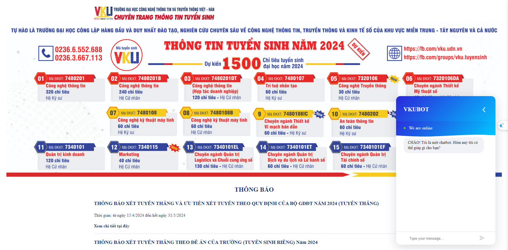

## Introduction:
The VKU Chatbot is a Python-based chatbot that utilizes machine learning algorithms and natural language processing (NLP) techniques to provide automated assistance to users with college-related inquiries. 
The chatbot aims to improve the user experience by delivering quick and accurate responses to their questions.

## How to Use the Chatbot

cd VKU-Chatbot-NLP

pip install -r requirements.txt

python app.py

## Training model Chatbot

run step by step "training-model-chatbot.ipynb"

python app.py

